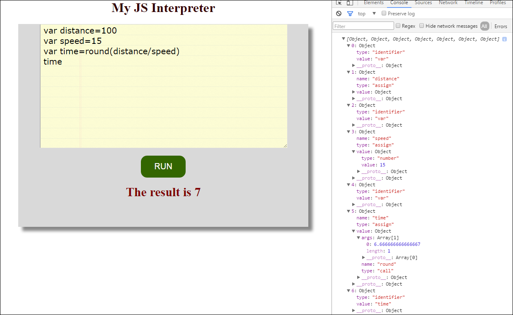

# Js-Interpreter
An Interpreter is a computer program that can
	1. parse source code
	2. convert it to an intermediate expression 
	3. executes the expression.
It doesn't do compilation, rather it executes directly.

The tool built here performs similar things like <b>generating a ParseTree<b> and evaluating the <b>expression<b>.

#How to Run
------------------------------------------------------------------------------------------------------------------------------
1.Go inside Interpreter folder.
2.Double Click on index.html(or you can open it in your favourite browser by 'Open With' ->Right Click on mouse) or open it in your localhost.

-------------------------------------------------------------------------------------------------------------------------------
Play with this cool Interpreter online at http://tub99.github.io/Interpreter/index.html<br> 
#Parse Tree
To see the parse tree output,open the console.
To open the console: Right click on Browse--> Click Inspect Element-->Go to Console

#Functionalities

1) Simple Mathematical operations(like addition,subtraction,multiplication,division)

For eg1:
```
	2*3+4
	The result is 10
```
For eg2:
```
	2**3+4
	Error: Token '*' is not recognized:
```

2) More advanced mathematical functions(like trigonometric{sin,cos,tan} and others{round,ceil,max,min,etc})

For eg1:
```
 	max(99,44,2,77,104)
 	The result is 104
 ```
For eg2:
```
	hello(2,4,6)
	Error: Token 'undefined' cannot be recognized
```

3) Storing values in variables and computing them{declare variables with var keyword}. 
WARNING!! Do not give ';' at the end of a statement

For eg1:
```
	var distance=100
	var speed=20
	var time=distance/speed
	time// for printing a variable just write the variable name and press RUN
	The result is 5
```
For eg2:
```
	sum=a+b
	The result is NAN {a->undefined,b->undefined}
```
4) Creating your own functions and calling them

For eg1:
```
	function sum(a,b)=a+b
	sum(6,12)
	The result is 18
```
For eg2:
```
	diff(a,b)
	Error: Token 'undefined' not recognized. a is undefined. b is undefined
```
### Sample Output
The console on the right-hand side contains the parse tree
<p align="center">
  
</p>

